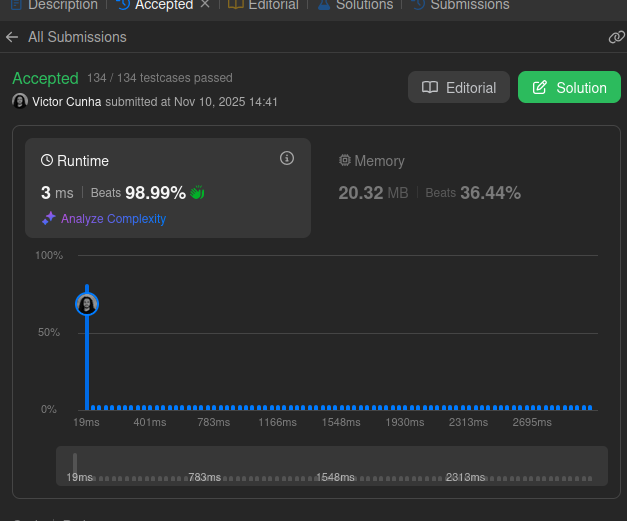
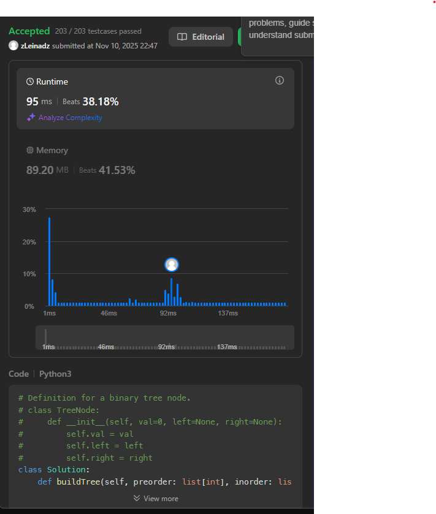
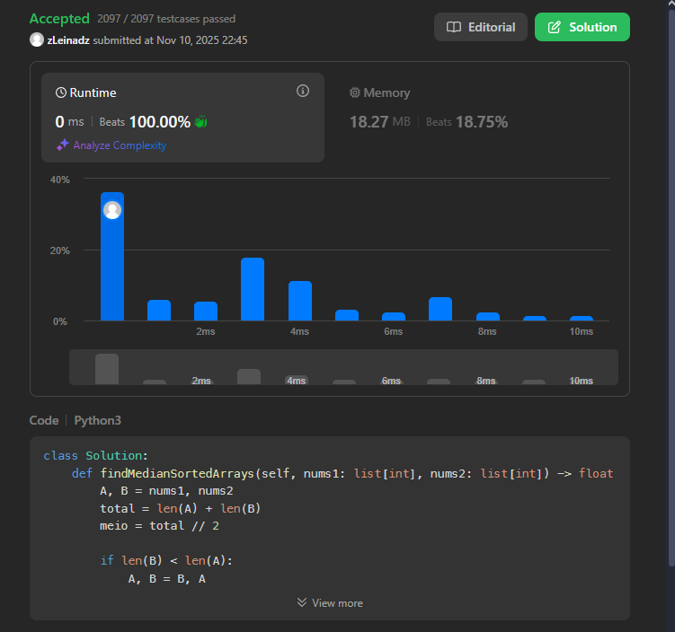

# DeC-Dupla-55

Temas:
 - Dividir e Conquistar

**Número da Lista**: 4<br>
**Conteúdo da Disciplina**: Dividir e Conquistar <br>

## Alunos
|Matrícula | Aluno |
| -- | -- |
| 21/1031520 |  Victor Hugo da Cunha Santos |
| 23/1037665 |  Daniel Rodrigues Nascimento |

## Sobre 
Resolução de exercícios do CodeForces/LeetCode/AtCoder/HackerRank de acordo com as condições
propostas pelo professor em sala de aula.


## Exercícios
|Exercício | Resolução | Dificuldade |
| -- | -- | -- |
| [Merge K Sorted Lists](https://leetcode.com/problems/merge-k-sorted-lists/description/) | [merge_k_sorted_lists.py](https://github.com/projeto-de-algoritmos-2025/DeC-D55/tree/main/merge_k_sorted_lists.py) | Difícil |
| [Median of Two Sorted Arrays](https://leetcode.com/problems/median-of-two-sorted-arrays/description) | [Median.py](https://github.com/projeto-de-algoritmos-2025/DeC-D55/tree/main/Median.py) | Difícil |
| [Construct Binary Tree from Preorder and Inorder Traversal](https://leetcode.com/problems/construct-binary-tree-from-preorder-and-inorder-traversal/description) | [Construct.py](https://github.com/projeto-de-algoritmos-2025/DeC-D55/tree/main/Construct.py) | Médio |


## Vídeo
|Vídeo de explicação|
|--|
| [Clique aqui]() |


## Screenshots
- *Merge K Sorted Lists*
<div align="center">
	
</div>
- *Median of Two Sorted Arrays*
<div align="center">
	
</div>
- *Construct Binary Tree from Preorder and Inorder Traversal*
<div align="center">
	
</div>


## Instalação 
**Linguagem**: <br>
- Python

## Uso 
- Ter o Python 3 instalado na máquina
- Para rodar a resolução do exercício BFSShortestReach:

```bash
python nome_do_arquivo.py
```

## Outros 
Quaisquer outras informações sobre seu projeto podem ser descritas abaixo.
